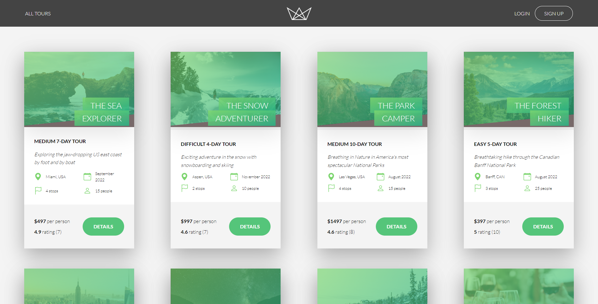
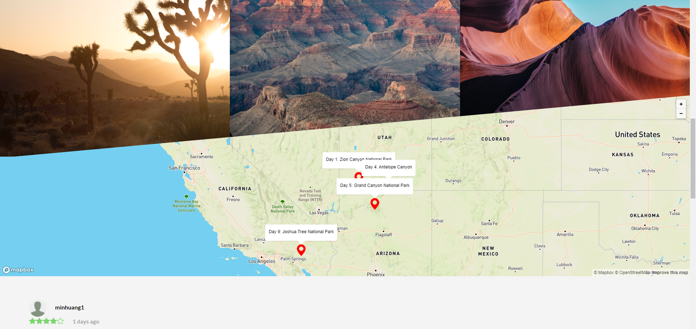
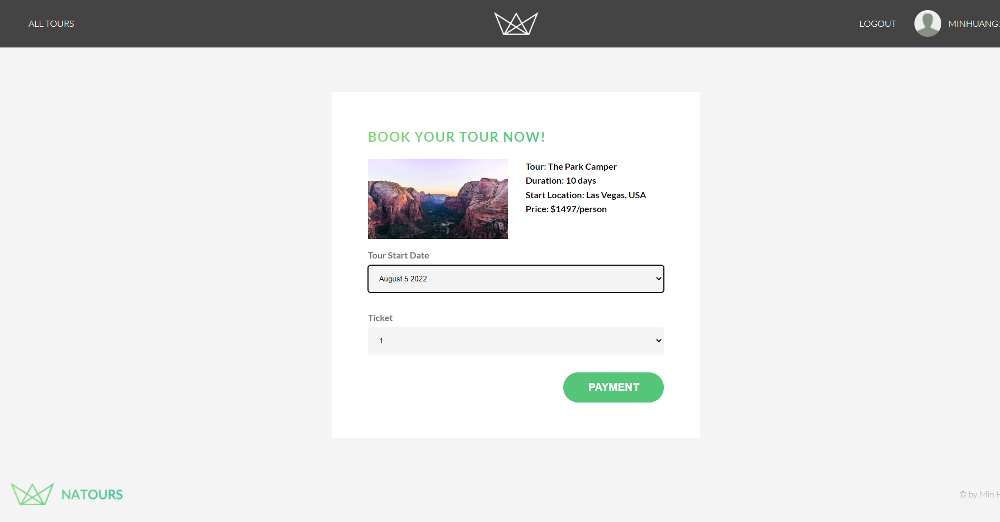
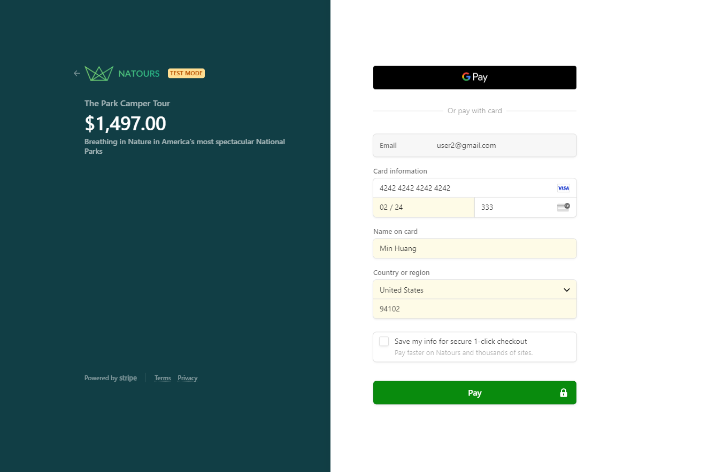
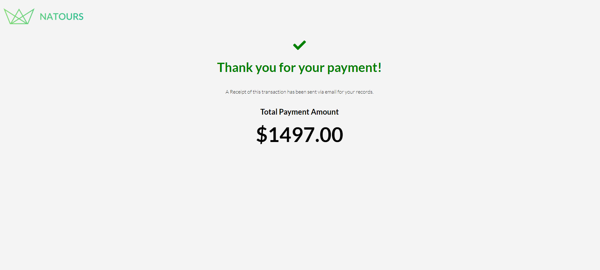
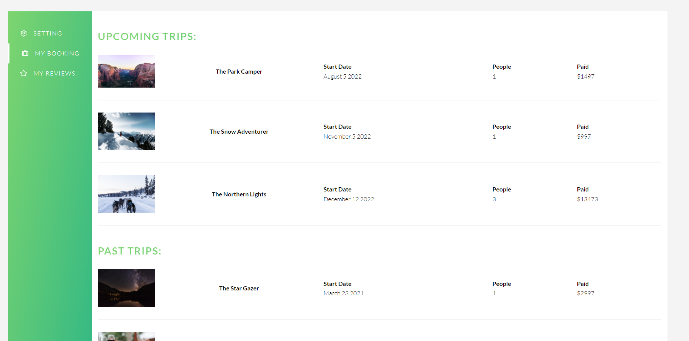

# Natours App

This is a tour booking application built with React

[https://natours-mh.netlify.app/](https://natours-mh.netlify.app/)

# Project Description

This project is part of the online course I've taken at Udemy. [https://www.udemy.com/course/nodejs-express-mongodb-bootcamp/](https://www.udemy.com/course/nodejs-express-mongodb-bootcamp/). Jonas Schmedtmann used PHP to build the web pages in his course. I used React to rebuild the frontend part. I also added some new features based on his UX/UI.

### Build With

---

- [React](https://reactjs.org/)
- [React Context](https://reactjs.org/docs/context.html)
- [React Router](https://reactrouter.com/)
- [formik](https://formik.org/)
- [yup](https://github.com/jquense/yup)
- [mapbox](https://www.mapbox.com/)

### Features

---

- Authentication and Authorization
  - Register/Login/logout
  - Require authentication to access user data
  - Require authentication to post a review
  - Require authentication to book a tour
- Tour
  - Display tour information
  - Display tour average rating based on the reviews
  - Display map with tour locations marks
  - Display tour reviews
- Payment
  - Use the 3rd party library to send payment - scripts
  - Direct to payment success page, if received payment
  - Direct to payment fail page, if didn't receive payment
  - ```
    scripts Test Mode:
    use this credit card to book a tour
    credit card: 4242 4242 4242
    expird date: MM/YY - any date will work
    cvv: 000 - any numbers will work
    ```
- User Profile
  - Update your username, email, photo, and password
  - Find your upcoming trips and past trips
  - Find your reviews

### Demonstration

---

**Home Page**:



**Tour Map with Location Marks**:



**Tour Booking Page**:



**Payment page**:



**Payment Success**:



**Booked Tours in User Profile**:



### API Usage

---

Check Natours API Documentation for more info.

### To-do

---

- Add filter function to the Tours Page
  - filter by level: easy, medium and difficult
- Add sort function to the Tours Page
  - sort tours by price, duration, rating, etc.
- Build admin profile
  - create, edit, and delete tours

### Contact Me

---

Feel free to email me at [minh.huang96@gmail.com](minh.huang96@gmail.com) if you have any issues, questions or ideas. Thank you! 🙂
